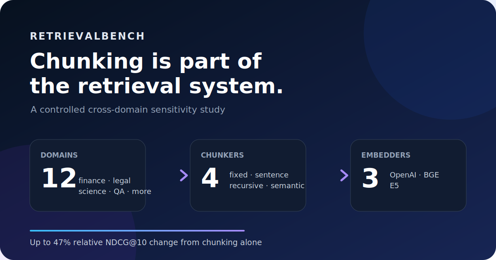
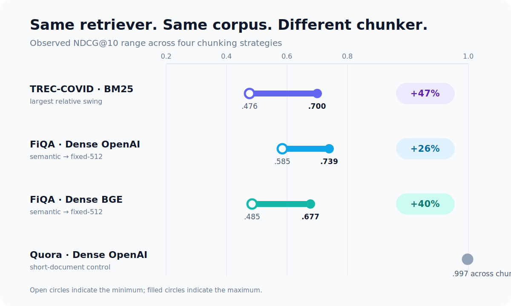
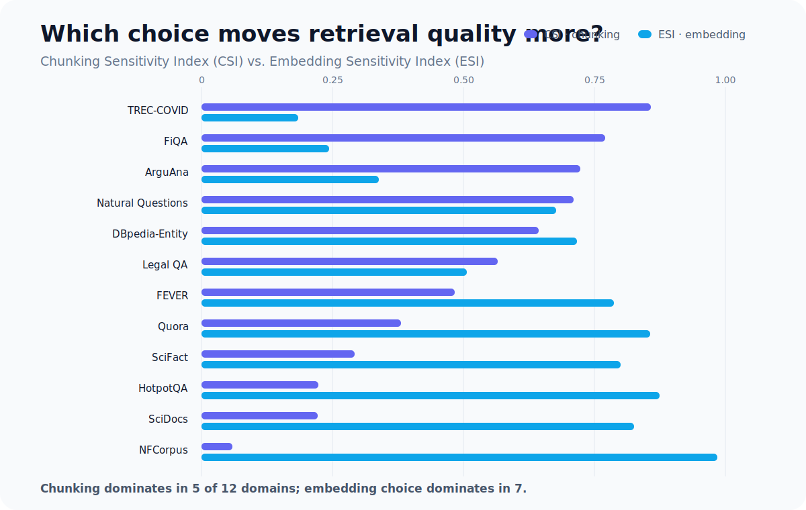

# Chunking Is Part of the Retrieval System

Most retrieval benchmarks begin after one of the most important design decisions has already been made.

They give you a corpus of documents, a set of queries, and relevance judgments. You choose a retriever, produce a ranking, and report a metric such as NDCG@10. But production retrieval systems rarely receive a corpus of perfectly sized, atomic passages. They receive reports, articles, court decisions, scientific abstracts, questions, and other documents that must be segmented before indexing.

That segmentation step—usually called **chunking**—is often treated as plumbing. Our experiments suggest it should be treated as part of the retrieval system itself.

In **RetrievalBench**, we evaluated four concrete chunking strategies across twelve domains and three dense embedding models, with BM25 as a sparse reference. Holding the corpus and retriever fixed, changing only the chunker moved NDCG@10 by as much as **47% relative**. But the second result is just as important: chunking did *not* dominate embedding choice everywhere. Its importance depended strongly on the domain.

This post explains what we measured, what we found, and how the results should change the way retrieval systems are evaluated.

## The hidden variable in retrieval benchmarks

Imagine two teams evaluating the same embedding model on the same source documents.

One team indexes 512-word windows. The other indexes groups of semantically similar sentences. Both report “the performance of the embedding model,” but they are not evaluating the same retrieval system. Their indexed units contain different evidence, different context boundaries, and different amounts of irrelevant text.

Chunking can affect retrieval in several ways:

- A chunk may separate a query-relevant sentence from the context needed to interpret it.
- A long window may mix multiple topics into one representation.
- Small chunks may improve matching precision while fragmenting evidence.
- Overlap can preserve boundary information but increases index size and embedding cost.
- Different embedding models may respond differently to the same chunk length and structure.

This means a fixed, undocumented chunking policy can quietly favor one model over another.

RetrievalBench makes that hidden choice explicit.

## A controlled 12 × 4 × 3 experiment

The main experiment spans twelve retrieval domains:

- finance (FiQA)
- legal question answering (Open Australian Legal QA)
- biomedical retrieval (TREC-COVID)
- medical retrieval (NFCorpus)
- scientific claim verification (SciFact)
- technical literature retrieval (SciDocs)
- argumentation (ArguAna)
- community duplicate-question retrieval (Quora)
- open-domain question answering (Natural Questions)
- entity retrieval (DBpedia-Entity)
- fact checking (FEVER)
- multi-hop question answering (HotpotQA)

For every domain, we evaluated the same four operational chunking policies:

1. **Fixed-512:** windows of up to 512 whitespace-delimited words with 50-word overlap.
2. **Sentence:** non-overlapping groups of three sentences.
3. **Recursive:** split first on paragraph boundaries, then split long paragraphs into sentences.
4. **Semantic:** merge adjacent sentences when their embedding cosine similarity is at least 0.75.

Dense retrieval was evaluated with:

- OpenAI `text-embedding-3-small`
- `BAAI/bge-small-en-v1.5`
- `intfloat/e5-small-v2`

We also included BM25 as a sparse reference. Dense embeddings were L2-normalized and scored by inner product. The retriever selected the top 50 chunks, aggregated them to parent documents by maximum score, and evaluated the top 10 unique documents.

To make the repeated indexing experiment tractable and comparable across domains, each matrix corpus used a shared seeded sampling policy: 2,000 sampled fill documents plus every qrels-relevant document, with up to 500 queries. Because a smaller distractor pool can inflate absolute scores, the matrix is intended for **within-domain comparisons among chunkers and embedders**, not as a replacement for full-corpus leaderboards.

## Result 1: chunking can move retrieval quality dramatically

The largest observed swing occurred on TREC-COVID with BM25. Semantic chunking produced an NDCG@10 of 0.476, while fixed-512 reached 0.700—a **47.1% relative improvement** with the retriever and corpus held fixed.

Finance showed the most consistent dense-retrieval effect. On FiQA, fixed-512 outperformed semantic chunking under all three embedding models:

| Embedder | Semantic | Fixed-512 | Relative change |
|---|---:|---:|---:|
| OpenAI | 0.585 | 0.739 | +26% |
| BGE-small | 0.485 | 0.677 | +40% |
| E5-small | 0.471 | 0.665 | +41% |

These are not small leaderboard fluctuations. They are large enough to reverse conclusions about whether a retrieval configuration is viable.

At the same time, the result is not “fixed windows always win.” Recursive chunking slightly led BM25 on ArguAna and SciFact. Semantic chunking produced the best OpenAI dense score on Natural Questions. The preferred strategy changed with the domain and sometimes with the retrieval model inside the same domain.

Quora provides an important control. Its source documents are short questions that are already close to atomic retrieval units. All four chunkers produced nearly identical scores. That is exactly what we should expect if chunking sensitivity is driven by how much segmentation can change the original document.

The practical lesson is simple:

> If the benchmark fixes chunking before model evaluation begins, the benchmark is fixing part of the system being evaluated.

## Result 2: chunking does not always matter more than the embedder

Practitioner discussions sometimes collapse into a binary argument: either the embedding model is the main decision, or chunking matters more than the model.

Our results do not support either universal claim.

To compare the two effects, we built a dense-retrieval matrix for each domain. Let \(M_{c,e}\) be NDCG@10 for chunker \(c\) and embedder \(e\). We then calculated two normalized sensitivity indices:

- **Chunking Sensitivity Index (CSI):** average variance across chunkers while holding the embedder fixed.
- **Embedding Sensitivity Index (ESI):** average variance across embedders while holding the chunker fixed.

Both are normalized by the total variance in the domain’s 4 × 3 matrix. CSI greater than ESI means chunker selection moved quality more than embedder selection within the evaluated candidate pool.

CSI exceeded ESI in **5 of 12 domains**:

- TREC-COVID
- FiQA
- ArguAna
- Natural Questions
- Open Australian Legal QA

Embedding choice dominated in the other seven, most strongly in NFCorpus, SciDocs, HotpotQA, and SciFact.

This gives us a more useful conclusion than “chunking matters more”:

> The value of tuning chunking versus tuning the embedding model is domain-dependent.

For a new corpus, the right first experiment is not necessarily a giant model bake-off or an exhaustive chunker search. A small crossed pilot—several chunkers against several plausible embedders—can reveal which axis deserves more engineering time.

## Why the interaction matters

CSI and ESI are useful summaries, but the full matrix contains another warning: chunking and embedding choice interact.

For example, on DBpedia-Entity, E5 moved from 0.792 with semantic chunking to 0.865 with fixed or recursive chunking. BGE, however, remained between 0.821 and 0.825 across all four strategies. Calling DBpedia simply “chunking-sensitive” would miss the fact that most of the chunking effect appears under one embedder.

This matters for model comparisons. Suppose model A wins under one segmentation and model B wins under another. A benchmark that reports only one chunking policy turns that policy into an unacknowledged model-selection prior.

A stronger evaluation report should therefore publish:

- the chunker implementation and parameters
- the tokenizer or unit used to define chunk size
- overlap and boundary rules
- the semantic model and threshold, if semantic chunking is used
- how chunk results are aggregated back to documents
- whether relevance judgments are document-level or chunk-level

Without those details, a retrieval score is harder to reproduce and easier to misinterpret.

## What this means for retrieval and RAG teams

The experiments suggest a practical workflow.

### 1. Treat chunking as a hyperparameter

Do not select a chunker only because it is the default in a framework. Include it in the evaluation grid alongside the embedding model and retrieval depth.

### 2. Start with a small crossed pilot

You do not need to index the full production corpus under every possible configuration. Start with a representative sample and a small set of plausible chunkers and embedders. Calculate within-domain sensitivity before committing to a large experiment.

### 3. Include a short-document control

If chunking changes results on documents that are already atomic, inspect the implementation carefully. Unexpected differences may indicate tokenization, empty-chunk, aggregation, or identifier bugs rather than a meaningful segmentation effect.

### 4. Keep boundaries stable when comparing embedders

If each embedder also generates its own semantic chunk boundaries, two variables change at once. In our matrix, semantic boundaries were generated once with the OpenAI model and reused across downstream embedders. This isolates retrieval-model sensitivity, although it may align the boundaries with the model that created them.

### 5. Separate retrieval quality from deployment accounting

Latency and cost matter, but they require explicit measurement boundaries. Offline corpus embedding, online query embedding, network time, vector search, aggregation, and reranking should not be mixed into a single number without explanation. RetrievalBench supports these measurements, but our central claims rely on the quality matrix rather than treating one machine’s timing as universal.

## What the study does not prove

The result is deliberately narrower than “these are the four best chunkers” or “chunking dominates model choice.”

The matrix uses one seeded sample per domain. Document-level relevance judgments are inherited through parent-document identity rather than annotated at the chunk level. The embedding pool mixes two small open-source models with an API model from a different training and capacity regime. Each chunker is one concrete implementation of a broader strategy family, and different window sizes, overlaps, separators, or semantic thresholds could change the result.

CSI and ESI should therefore be read as properties of a domain **under a declared candidate set**, not as permanent constants.

These limitations do not erase the central observation. They reinforce it: retrieval quality depends on choices that benchmarks often leave implicit.

## A better default for retrieval evaluation

The standard model leaderboard asks:

> Which retriever performs best on this fixed corpus?

For systems that must segment their own source documents, a more realistic question is:

> Which combination of chunking policy and retriever performs best for this domain?

Across twelve domains, changing only the chunker altered NDCG@10 by up to 47% relative. In five domains, chunker selection moved quality more than embedding-model selection; in seven, the reverse was true. There was no universal winner and no universal ordering of engineering priorities.

That is the main finding of RetrievalBench: **chunking is not preparation for retrieval. It is part of retrieval.**

---

The paper and experiment implementation are available in the RetrievalBench repository. The released artifacts include the aggregate per-domain matrix results, bootstrap uncertainty estimates, and the CSI/ESI analysis used in this post.

